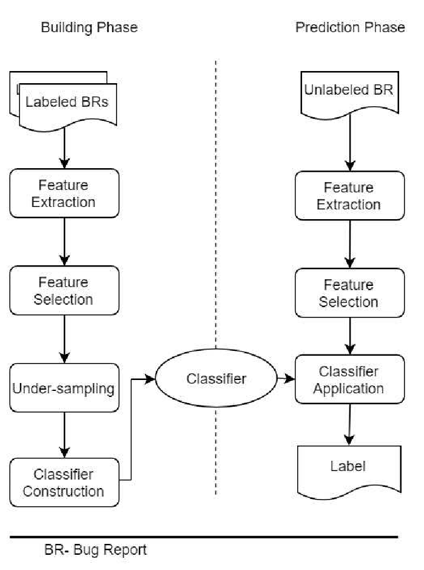

# Generalized Approach for Bug Report Claasification


# Publications
```
Das, Dipok Chandra, and Md Rayhanur Rahman. "Security and performance bug reports identification with class-imbalance sampling and feature selection." 2018 Joint 7th International Conference on Informatics, Electronics & Vision (ICIEV) and 2018 2nd International Conference on Imaging, Vision & Pattern Recognition (icIVPR). IEEE, 2018.
```
